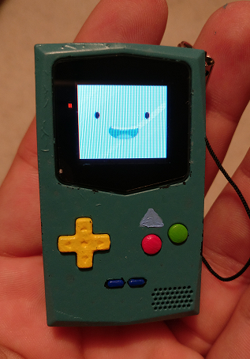

# BMO-chooser

The first thing you see when you start your PocketSprite is the chooser. It's main tasks are to allow you to upload/delete files (including apps) via WiFi Access Point and launch apps that are present on the filesystem.

This is a modified version of the chooser.app, which greets you with a BMO smile when you launch it (with wifi disabled).

## Installing
1. Download the [latest version from GitHub](https://github.com/rorosaurus/8bkc-bmo-chooser/releases/latest)
2. Rename `chooser.bin` to `chooser.app` (GitHub won't let me release a .app file)
3. Follow the [normal app installation instructions](https://pocketsprite.com/pages/faq#functionality)

## Future goals
* Add a small sound byte: "Who wants to play *videogames*?!"
* Reduce filesize further
  * Draw the eyes/mouth separately
* Some light "animation"

## Revert to the old chooser
Follow the [instructions on the FAQ](https://pocketsprite.com/pages/faq#update) to revert to the original `chooser.app`
